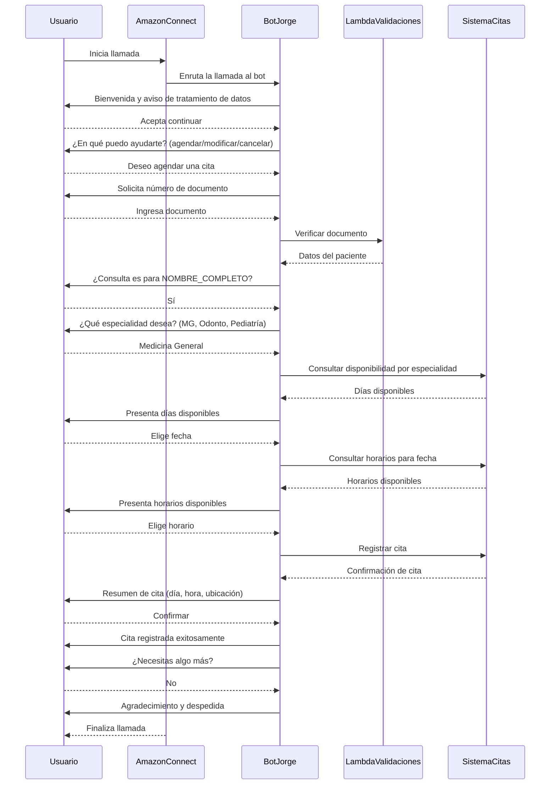
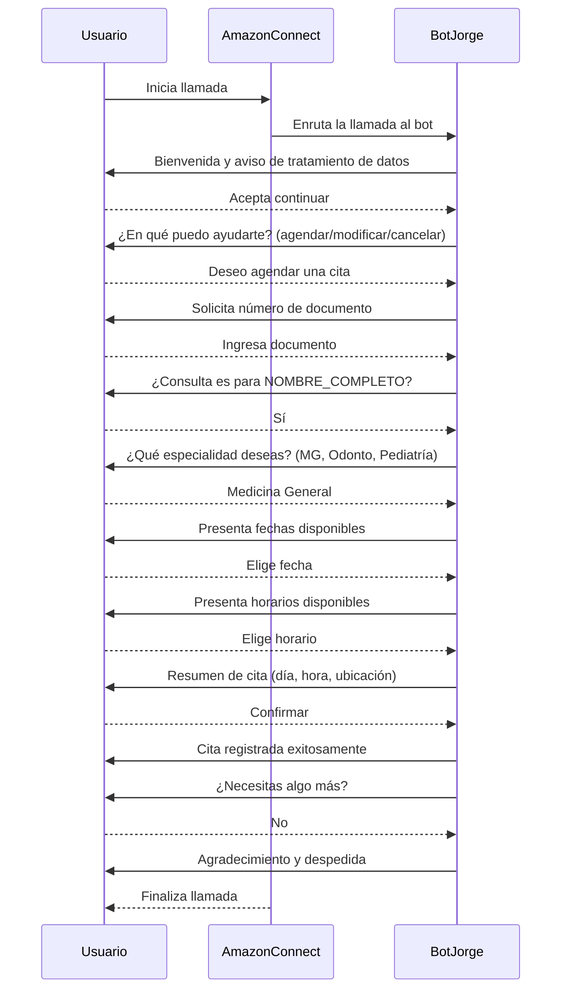

```mermaid
sequenceDiagram
    participant Usuario
    participant AmazonConnect
    participant BotJorge
    participant LambdaValidaciones
    participant SistemaCitas

    Usuario->>AmazonConnect: Inicia llamada
    AmazonConnect->>BotJorge: Enruta la llamada al bot

    BotJorge->>Usuario: Bienvenida y aviso de tratamiento de datos
    Usuario-->>BotJorge: Acepta continuar

    BotJorge->>Usuario: ¿En qué puedo ayudarte? (agendar/modificar/cancelar)
    Usuario-->>BotJorge: Deseo agendar una cita

    BotJorge->>Usuario: Solicita número de documento
    Usuario-->>BotJorge: Ingresa documento

    BotJorge->>LambdaValidaciones: Verificar documento
    LambdaValidaciones-->>BotJorge: Datos del paciente

    BotJorge->>Usuario: ¿Consulta es para NOMBRE_COMPLETO?
    Usuario-->>BotJorge: Sí

    BotJorge->>Usuario: ¿Qué especialidad desea? (MG, Odonto, Pediatría)
    Usuario-->>BotJorge: Medicina General

    BotJorge->>SistemaCitas: Consultar disponibilidad por especialidad
    SistemaCitas-->>BotJorge: Días disponibles

    BotJorge->>Usuario: Presenta días disponibles
    Usuario-->>BotJorge: Elige fecha

    BotJorge->>SistemaCitas: Consultar horarios para fecha
    SistemaCitas-->>BotJorge: Horarios disponibles

    BotJorge->>Usuario: Presenta horarios disponibles
    Usuario-->>BotJorge: Elige horario

    BotJorge->>SistemaCitas: Registrar cita
    SistemaCitas-->>BotJorge: Confirmación de cita

    BotJorge->>Usuario: Resumen de cita (día, hora, ubicación)
    Usuario-->>BotJorge: Confirmar

    BotJorge->>Usuario: Cita registrada exitosamente
    BotJorge->>Usuario: ¿Necesitas algo más?
    Usuario-->>BotJorge: No

    BotJorge->>Usuario: Agradecimiento y despedida
    AmazonConnect-->>Usuario: Finaliza llamada
```

```mermaid
sequenceDiagram
    participant Usuario
    participant AmazonConnect
    participant BotJorge

    Usuario->>AmazonConnect: Inicia llamada
    AmazonConnect->>BotJorge: Enruta la llamada al bot

    BotJorge->>Usuario: Bienvenida y aviso de tratamiento de datos
    Usuario-->>BotJorge: Acepta continuar

    BotJorge->>Usuario: ¿En qué puedo ayudarte? (agendar/modificar/cancelar)
    Usuario-->>BotJorge: Deseo agendar una cita

    BotJorge->>Usuario: Solicita número de documento
    Usuario-->>BotJorge: Ingresa documento

    BotJorge->>Usuario: ¿Consulta es para NOMBRE_COMPLETO?
    Usuario-->>BotJorge: Sí

    BotJorge->>Usuario: ¿Qué especialidad deseas? (MG, Odonto, Pediatría)
    Usuario-->>BotJorge: Medicina General

    BotJorge->>Usuario: Presenta fechas disponibles
    Usuario-->>BotJorge: Elige fecha

    BotJorge->>Usuario: Presenta horarios disponibles
    Usuario-->>BotJorge: Elige horario

    BotJorge->>Usuario: Resumen de cita (día, hora, ubicación)
    Usuario-->>BotJorge: Confirmar

    BotJorge->>Usuario: Cita registrada exitosamente
    BotJorge->>Usuario: ¿Necesitas algo más?
    Usuario-->>BotJorge: No

    BotJorge->>Usuario: Agradecimiento y despedida
    AmazonConnect-->>Usuario: Finaliza llamada
```

