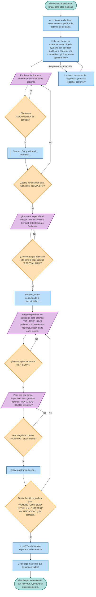

# Flujo de agendamiento de citas medicas

```mermaid
%%{init: { "flowchart": { "htmlLabels": true, "curve": "linear" } } }%%

flowchart TD
    inicio(["Bienvenido al asistente virtual para citas médicas."]):::green
    datosPersonales["Al continuar en la línea, acepta nuestra política de tratamiento de datos."]:::blue
    presentacionBot["`Hola, soy Jorge, tu asistente virtual. Puedo ayudarte con agendar, modificar o cancelar una cita médica. ¿Cómo puedo ayudarte hoy?`"]:::blue

    solicitarDocumento[/"`Por favor, indícame el número de documento del paciente.`"/]:::purple
    confirmarDocumento{"`¿El número “DOCUMENTO” es correcto?`"}:::orange
    validandoDocumento["`Gracias. Estoy validando tus datos…`"]:::blue

    confirmarIdentidad{"`¿Estás consultando para “NOMBRE_COMPLETO”?`"}:::orange

    solicitarEspecialidad[/"`¿Para cuál especialidad deseas la cita? Medicina General, Odontología o Pediatría.`"/]:::purple
    confirmarEspecialidad{"`¿Confirmas que deseas la cita para la especialidad “ESPECIALIDAD”?`"}:::orange

    buscandoDisponibilidad["`Perfecto, estoy consultando la disponibilidad…`"]:::blue
    mostrarFechas[/"`Tengo disponibles los siguientes días del mes: “DÍA - MES”. ¿Cuál prefieres? Si deseas más opciones, puedo darte otras fechas.`"/]:::purple
    confirmarFecha{"`¿Deseas agendar para el día “FECHA”?`"}:::orange

    mostrarHorarios[/"`Para ese día, tengo disponibles los siguientes horarios: “HORARIOS”. ¿Cuál te conviene?`"/]:::purple
    confirmarHorario{"`Has elegido el horario “HORARIO”. ¿Es correcto?`"}:::orange

    procesandoAgendamiento["`Estoy registrando tu cita…`"]:::blue

    resumenCita{"`Tu cita ha sido agendada para “NOMBRE_COMPLETO” el “DÍA” a las “HORARIO” en “UBICACIÓN”. ¿Es correcto?`"}:::orange
    citaConfirmada["`¡Listo! Tu cita ha sido registrada exitosamente.`"]:::blue

    ofrecerAyuda["`¿Hay algo más en lo que te pueda ayudar?`"]:::blue
    despedida(["`Gracias por comunicarte con nosotros. Que tengas un excelente día.`"]):::green

    errorOpcion["`Lo siento, no entendí tu respuesta. ¿Podrías repetirlo, por favor?`"]:::blue

    %% Conexiones del flujo
    inicio --> datosPersonales
    datosPersonales --> presentacionBot
    presentacionBot --> solicitarDocumento
    presentacionBot -->|Respuesta no entendida| errorOpcion
    errorOpcion --> presentacionBot

    solicitarDocumento --> confirmarDocumento
    confirmarDocumento -->|No| solicitarDocumento
    confirmarDocumento -->|Sí| validandoDocumento
    validandoDocumento --> confirmarIdentidad
    confirmarIdentidad -->|No| solicitarDocumento
    confirmarIdentidad -->|Sí| solicitarEspecialidad

    solicitarEspecialidad --> confirmarEspecialidad
    confirmarEspecialidad -->|No| solicitarEspecialidad
    confirmarEspecialidad -->|Sí| buscandoDisponibilidad
    buscandoDisponibilidad --> mostrarFechas

    mostrarFechas --> confirmarFecha
    confirmarFecha -->|No| mostrarFechas
    confirmarFecha -->|Sí| mostrarHorarios

    mostrarHorarios --> confirmarHorario
    confirmarHorario -->|No| mostrarHorarios
    confirmarHorario -->|Sí| procesandoAgendamiento

    procesandoAgendamiento --> resumenCita
    resumenCita -->|No| mostrarFechas
    resumenCita -->|Sí| citaConfirmada
    citaConfirmada --> ofrecerAyuda
    ofrecerAyuda --> despedida

%% Estilos
classDef green fill:#B2DFDB,stroke:#00897B,stroke-width:2px;
classDef orange fill:#FFE0B2,stroke:#FB8C00,stroke-width:2px;
classDef blue fill:#BBDEFB,stroke:#1976D2,stroke-width:2px;
classDef purple fill:#E1BEE7,stroke:#8E24AA,stroke-width:2px;
```
