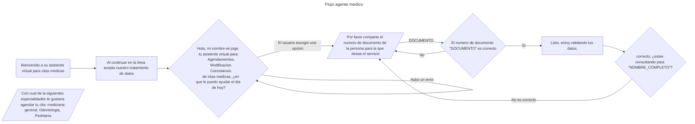

# Flujo

```mermaid
---
title: Flujo agente medico
---
flowchart LR

    bienvenida("Bienvenido a su asistente virtual para citas medicas")
    tratamientoDatos["Al continuar en la linea acepta nuestro tratamiento de datos"]
    presentacion{"Hola, mi nombre es joge, tu asistente virtual para:
     Agendameintos.
     Modificacion.
     Cancelacion.
     de citas medicas, ¿en que le puedo ayudar el dia de hoy?"}
    docu@{ shape: lean-r, label: "Por favor comparte el numero de documento de la persona para la que desaa el servicio" }
    verifDocu{"El numero de documento “DOCUMENTO” es correcto"}
    validaconDocu["Listo, estoy validando tus datos."]
    verifNombre{"correcto, ¿estas consultando para “NOMBRE_COMPLETO”?"}
    especialidad@{ shape: lean-r, label: "Con cual de la siguientes especialidades te gustaria agendar tu cita: mediciana general, Odontologia, Pedriatria"}

    bienvenida --> tratamientoDatos
    tratamientoDatos -->presentacion
    presentacion -->|Hubo un error| presentacion
    presentacion -->|El usuario escogio una opcion|docu
    docu -->|DOCUMENTO|verifDocu
    verifDocu -->|No|docu
    verifDocu -->|Si|validaconDocu
    validaconDocu -->verifNombre
    verifNombre -->|No es correcto|docu

```
