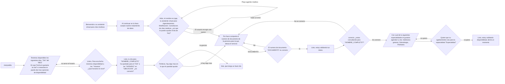

# Flujo

```mermaid
---
title: Flujo agente medico
---
flowchart LR

    bienvenida("Bienvenido a su asistente virtual para citas medicas")

    tratamientoDatos["Al continuar en la linea acepta nuestro tratamiento de datos"]

    presentacion{"Hola, mi nombre es joge, tu asistente virtual para: Agendameintos. Modificacion. Cancelacion. de citas medicas, ¿en que le puedo ayudar el dia de hoy?"}

    docu@{ shape: lean-r, label: "Por favor comparte el numero de documento de la persona para la que desaa el servicio" }

    verifDocu{"El numero de documento “DOCUMENTO” es correcto"}

    validaconDocu["Listo, estoy validando tus datos."]

    verifNombre{"correcto, ¿estas consultando para “NOMBRE_COMPLETO”?"}

    especialidad@{ shape: lean-r, label: "Con cual de la siguientes especialidades te gustaria agendar tu cita: mediciana general, Odontologia, Pedriatria"}

    varifEspeci{"Quiere que su agedaminetos sea para la especialidad ˝Especialidad˝"}

    msjvalida["Listo, estoy validando disponibilidad, deme un momento"]

    agenDia@{ shape: lean-r, label: "Tenemos disponibles los siguientes dias. ˝DIA˝ del ˝MES˝<x4 opciones>
    En que Fecha te gustaria la cita? si nesesitas te puedo dar mas opciones de disponibilidad"}

    agendHora{"Listos, Para esa fecha tenemos disponiblidad a las: ˝Horarios˝
    ¿Que horarios te sirve?"}

    msjAgenCitas["Listo, tu cita para ˝NOMBRE_COMPLETO˝ ha quedado para el ˝DIA˝ a las ˝HORARIO˝ en ˝UBICACION˝. ¿es correcto?"]

    msjRetorno{"Perfecto, hay algo mas en lo que le puedad ayudar"}

    msjDespedida("listo, que tenga un buen dia")

    bienvenida --> tratamientoDatos
    tratamientoDatos -->presentacion
    presentacion -->|Hubo un error| presentacion
    presentacion -->|El usuario escogio una opcion|docu
    docu -->|DOCUMENTO|verifDocu
    verifDocu -->|No|docu
    verifDocu -->|Si|validaconDocu
    validaconDocu -->verifNombre
    verifNombre -->|No es correcto|docu
    verifNombre -->|Es correcto|especialidad
    especialidad --> varifEspeci
    varifEspeci -->|no quiero|especialidad
    varifEspeci -->|si quiero|msjvalida
    mesjvalida -->agenDia
    agenDia -->agendHora
    agendHora -->|no serve el horario|agenDia
    agendHora -->msjAgenCitas
    msjAgenCitas --> msjRetorno
    msjRetorno -->|si hay algo mas|docu
    msjRetorno -->|no,gracias|msjDespedida

```
